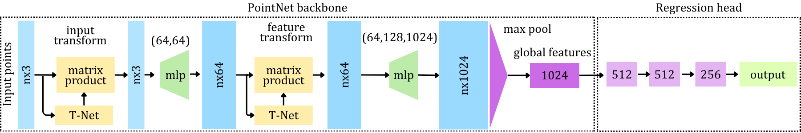

# TerrainFreeSpaceNet

TerrainFreeSpaceNet is a PointNet-based deep learning framework for predicting
**continuous terrain free-space (traversability) scores** directly from 3D
point cloud data.

The network extends the original PointNet classification architecture by
introducing a **regression head** that outputs a scalar free-space score in the
range **[0, 1]**, enabling fine-grained assessment of navigable terrain in
uneven and unstructured outdoor environments.

The training pipeline is designed for **large-scale datasets** distributed
across **multiple CSV files**, where each file may contain many point cloud
frames identified by a `frame_id`. Data are loaded lazily at runtime to avoid
excessive memory usage.

---

## Overview

- **Input**: 3D point clouds (e.g., LiDAR or RGB-D) stored in CSV format  
- **Output**: Continuous free-space score ∈ [0, 1] per frame  
- **Backbone**: PointNet (shared MLP + symmetric max pooling)  
- **Head**: Regression network (512 → 512 → 256 → 1)  
- **Target domain**: Mapless navigation and terrain assessment for ground robots (agoraphilic-3D) 

---

## Model Architecture

The network follows the PointNet paradigm, where each point is processed
independently using shared multilayer perceptrons (MLPs), followed by a
symmetric aggregation function to obtain a global feature vector.

A regression head is then applied to estimate the terrain free-space score.

<p align="center">
  
</p>


**Architecture summary:**
- Shared MLP: `3 → 64 → 128 → 1024`
- Symmetric aggregation: **Max pooling**
- Regression head:
  - FC(1024 → 512)
  - FC(512 → 512)
  - FC(512 → 256)
  - FC(256 → 1) + Sigmoid

The final sigmoid activation ensures the predicted free-space score lies in
the range **[0, 1]**.

---

## Input Data Format

### General structure
- Data are stored across **one or more CSV files**
- Each CSV may contain **multiple point cloud frames**
- Each frame is identified by a unique `frame_id`
- All points belonging to the same frame share the same `free_space` label

### Required CSV columns

| Column name | Description |
|------------|-------------|
| `frame_id` | Integer identifier for each point cloud frame |
| `x` | X coordinate of the point (meters) |
| `y` | Y coordinate of the point (meters) |
| `z` | Z coordinate of the point (meters) |
| `free_space` | Continuous free-space score ∈ [0, 1] for the frame |

### Example CSV content

```csv
frame_id,x,y,z,free_space
12,0.42,1.15,0.03,0.82
12,0.38,1.10,0.02,0.82
12,0.40,1.18,0.05,0.82
.
.
13,0.10,0.85,-0.01,0.35
13,0.12,0.90,0.00,0.35
.
.
```

##  Citation

If you use this code in your research, please cite the paper

```bibtex
@article{10.1007/s12555-025-0624-2,
   author = {Gunathilaka, W. M. Dinusha and Kahandawa, Gayan and Ibrahim, M. Yousef and Hewawasam, H. S. and Nguyen, Linh},
   title = {Agoraphilic-3D Net: A Deep Learning Method for Attractive Force Estimation in Mapless Path Planning for Unstructured Terrain},
   journal = {International Journal of Control, Automation and Systems},
   volume = {23},
   number = {12},
   pages = {3790-3802},
   ISSN = {2005-4092},
   DOI = {10.1007/s12555-025-0624-2},
   url = {https://doi.org/10.1007/s12555-025-0624-2},
   year = {2025},
   type = {Journal Article}
}
```
