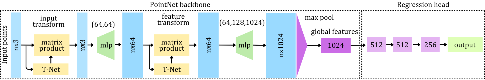

# TerrainFreeSpaceNet

**TerrainFreeSpaceNet** is a deep learning framework for predicting terrain free-space from 3D point-cloud data.
It is designed to support terrain-aware robot navigation in uneven and unstructured environments.

The model learns to estimate a continuous free-space score from raw 3D point clouds, enabling robots to reason about traversable terrain regions in real time.

This project is part of the **Agoraphilic-3D Navigation Framework**, developed for autonomous ground robots operating in complex outdoor environments.

## Overview

Autonomous ground robots operating in natural environments must handle:

- uneven terrain
- vegetation
- slopes and depressions
- irregular obstacles
- incomplete perception data

Traditional grid-based free-space methods struggle in these conditions.

TerrainFreeSpaceNet addresses this by learning free-space directly from 3D point clouds using a PointNet-style neural network.

The system processes raw point clouds and outputs a normalized terrain free-space score representing the traversability of the observed terrain.

## Method Overview

The TerrainFreeSpaceNet pipeline consists of the following stages:

1. 3D point cloud acquisition
2. frame-level point sampling
3. point cloud normalization
4. PointNet-style feature extraction
5. global feature aggregation
6. free-space regression

## Architecture

The model uses a PointNet-inspired architecture designed for unordered point sets.

- Key components:
- shared MLP layers implemented using Conv1D
- batch normalization
- ReLU activation
- global max pooling
- regression head predicting terrain free-space


### Architecture summary
```
  Input Point Cloud (N x 3)
          │
  Shared MLP Layers
          │
  Point Features
          │
  Global Max Pooling
          │
  Global Feature Vector
          │
  Fully Connected Layers
          │
  Free-Space Score (0–1)
  ```




## Installation

Clone the repository:
```
git clone https://github.com/dinusharg/TerrainFreeSpaceNet.git
cd TerrainFreeSpaceNet
```

Create a virtual environment:
```
python3 -m venv .venv
source .venv/bin/activate
```

Install dependencies:
```
pip install -r requirements.txt
```

## Input Data Format

Training data should be provided as CSV files containing point cloud frames.

Example format:

```csv
frame_id,x,y,z,free_space
12,0.42,1.15,0.03,0.82
12,0.38,1.10,0.02,0.82
12,0.40,1.18,0.05,0.82
.
.
13,0.10,0.85,-0.01,0.35
13,0.12,0.90,0.00,0.35
.
.
```

Columns:

| Column name | Description |
|------------|-------------|
| `frame_id` | Integer identifier for each point cloud frame |
| `x` | X coordinate of the point (meters) |
| `y` | Y coordinate of the point (meters) |
| `z` | Z coordinate of the point (meters) |
| `free_space` | Continuous free-space score ∈ [0, 1] for the frame |


## Model Training

Put the data csv files inside data folder. Change the training parameters according to the user requirments. 
```
python -m terrainfreespacenet.train \
  --data_dir data \
  --save_path checkpoints/terrainfreespacenet_best.pt \
  --num_points 2048 \
  --batch_size 16 \
  --epochs 50
```


## Model Inference

Run inference on a point cloud CSV:
```
python -m terrainfreespacenet.infer \
  --input_csv examples/sample_input.csv \
  --checkpoint checkpoints/terrainfreespacenet_best.pt
```

Example output:
```
{
  "free_space_score": 0.842,
  "num_points_used": 2048,
  "device": "cpu"
}
```

## Model Evaluation

Evaluate model performance on validation data:
```
python -m terrainfreespacenet.evaluate \
  --data_dir data \
  --checkpoint checkpoints/terrainfreespacenet_best.pt
```
Evaluation metrics:

- MSE
- MAE
- RMSE
- R² score

## Demo app

Demo app can be useed as local testing interface. 

Run:
```
python app.py
```

Open the URL in CLI output and upload a point-cloud CSV and obtain the predicted free-space score.

## Hugging Face Demo

Interactive demo available at:

https://huggingface.co/spaces/Dinusharg/TerrainFreeSpaceNet-demo

## Research Context

TerrainFreeSpaceNet was developed as part of research on:

**Autonomous Robot Navigation in Uneven Terrain Using 3D Perception**

The approach uses machine learning to estimate terrain traversability from raw point cloud data.


## Citation


If you use this code in your research, please cite the paper

```bibtex
@article{10.1007/s12555-025-0624-2,
   author = {Gunathilaka, W. M. Dinusha and Kahandawa, Gayan and Ibrahim, M. Yousef and Hewawasam, H. S. and Nguyen, Linh},
   title = {Agoraphilic-3D Net: A Deep Learning Method for Attractive Force Estimation in Mapless Path Planning for Unstructured Terrain},
   journal = {International Journal of Control, Automation and Systems},
   volume = {23},
   number = {12},
   pages = {3790-3802},
   ISSN = {2005-4092},
   DOI = {10.1007/s12555-025-0624-2},
   url = {https://doi.org/10.1007/s12555-025-0624-2},
   year = {2025},
   type = {Journal Article}
}
```


## License

MIT License


------------------

